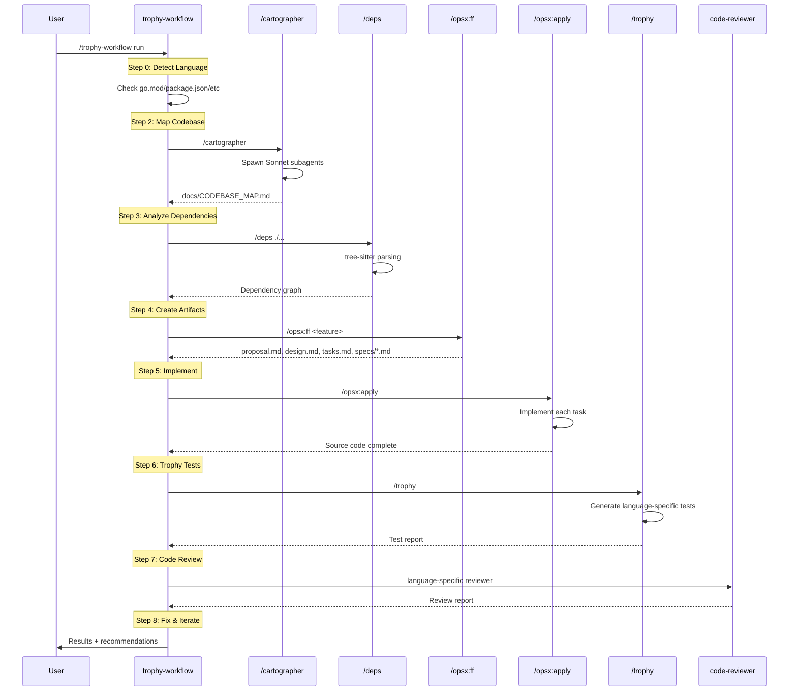

# Trophy Workflow Architecture Map

> Auto-generated by Cartographer. Last mapped: 2026-02-03T23:39:52Z

## System Overview

```mermaid
graph TB
    subgraph "Step 0: Detection"
        LD[Language Detection]
    end

    subgraph "Step 1: Setup"
        TS[Tree-sitter MCP]
    end

    subgraph "Step 2: Mapping"
        CART[/cartographer]
        CMAP[docs/CODEBASE_MAP.md]
    end

    subgraph "Step 3: Analysis"
        DEPS[/deps]
        DEP_GRAPH[Dependency Graph]
    end

    subgraph "Step 4: Specification"
        OPSX_FF[/opsx:ff]
        PROP[proposal.md]
        DES[design.md]
        TASKS[tasks.md]
        SPECS[specs/*.md]
    end

    subgraph "Step 5: Implementation"
        OPSX_APPLY[/opsx:apply]
        CODE[Source Code]
    end

    subgraph "Step 6: Testing"
        TROPHY[/trophy]
        GO_TR[/go-trophy]
        PY_TR[/python-testing]
        JAVA_TR[/springboot-trophy]
        TESTS[Integration Tests]
    end

    subgraph "Step 7: Review"
        GO_REV[go-reviewer]
        PY_REV[python-reviewer]
        CODE_REV[code-reviewer]
    end

    subgraph "Step 8: Iteration"
        FIX[Fix & Iterate]
    end

    LD --> TS
    TS --> CART
    CART --> CMAP
    CMAP --> DEPS
    DEPS --> DEP_GRAPH
    DEP_GRAPH --> OPSX_FF
    OPSX_FF --> PROP --> DES --> TASKS --> SPECS
    SPECS --> OPSX_APPLY
    OPSX_APPLY --> CODE
    CODE --> TROPHY
    LD -.->|Go| GO_TR
    LD -.->|Python| PY_TR
    LD -.->|Java| JAVA_TR
    TROPHY --> TESTS
    GO_TR --> TESTS
    PY_TR --> TESTS
    JAVA_TR --> TESTS
    TESTS --> GO_REV
    TESTS --> PY_REV
    TESTS --> CODE_REV
    GO_REV --> FIX
    PY_REV --> FIX
    CODE_REV --> FIX
    FIX -.->|Loop| CODE
```

## Workflow Execution Flow



## Step-by-Step Architecture

### Step 0: Language Detection

| File Indicator | Language | Test Pattern | Reviewer |
|----------------|----------|--------------|----------|
| `go.mod` | Go | Table-driven | `go-reviewer` |
| `pyproject.toml` | Python | pytest | `python-reviewer` |
| `package.json` | TypeScript | Jest/Vitest | `code-reviewer` |
| `pom.xml` | Java | JUnit 5 | `code-reviewer` |

**Override**: `--lang go|python|typescript|java`

---

### Step 1: Setup (One-Time)

**Purpose**: Configure tree-sitter MCP server

**Configuration**:
```json
{
  "mcpServers": {
    "tree-sitter": {
      "command": "uvx",
      "args": ["mcp-tree-sitter"]
    }
  }
}
```

**MCP Tools Enabled**:
- `mcp__tree-sitter__tree-sitter-deps`
- `mcp__tree-sitter__generate-grammar`

---

### Step 2: Map Codebase

**Skill**: `/cartographer`

```
Input: Project root
         ↓
    scan-codebase.py (token counting)
         ↓
    Plan subagent assignments (~150k tokens each)
         ↓
    Spawn parallel Sonnet subagents
         ↓
    Synthesize reports
         ↓
Output: docs/CODEBASE_MAP.md
```

**Produces**:
- System overview with Mermaid diagrams
- Directory structure annotations
- Module guide with exports/dependencies
- Data flow diagrams
- Navigation guide

---

### Step 3: Analyze Dependencies

**Skill**: `/deps`

```
Input: Source directory + CODEBASE_MAP.md
         ↓
    tree-sitter parsing
         ↓
    Extract imports/exports/calls
         ↓
    Build dependency graph
         ↓
Output: Validation report
```

**Output Format**:
```json
{
  "files": {
    "api/auth.py": {
      "imports": { "external": [], "internal": [] },
      "exports": { "functions": [] }
    }
  },
  "dependency_graph": { "file_level": {} }
}
```

---

### Step 4: Create OpenSpec Artifacts

**Skill**: `/opsx:ff <feature-name>`

```
Input: Feature description
         ↓
    Create openspec/changes/<name>/
         ↓
    Generate proposal.md (what)
         ↓
    Generate design.md (how)
         ↓
    Generate tasks.md (steps)
         ↓
    Generate specs/*.md (scenarios)
         ↓
Output: Complete OpenSpec artifacts
```

**Directory Structure**:
```
openspec/changes/<feature>/
├── .openspec.yaml
├── proposal.md
├── design.md
├── tasks.md
└── specs/
    └── <component>/
        └── spec.md
```

**Spec Format**:
```markdown
#### Scenario: Successful login

- **WHEN** user submits valid credentials
- **THEN** system returns auth token
- **AND** token expires in 24 hours
```

---

### Step 5: Implement with OPSX

**Skill**: `/opsx:apply`

```
Input: OpenSpec artifacts
         ↓
    Read context (proposal, design, tasks, specs)
         ↓
    Loop through tasks.md
         ↓
    Implement each task
         ↓
    Mark complete: [ ] → [x]
         ↓
Output: Source code
```

**Fluid Workflow**: Can pause to update artifacts if design issues found

---

### Step 6: Generate & Run Trophy Tests

**Skill**: `/trophy` (dispatches to language-specific)

```
Input: specs/*.md + Source code + Language
         ↓
    Find all WHEN/THEN scenarios
         ↓
    Apply language-specific pattern:
    ├── Go: Table-driven tests
    ├── Python: pytest classes
    ├── TypeScript: Jest describe blocks
    └── Java: JUnit 5 + Testcontainers
         ↓
    Generate test files
         ↓
    Run tests
         ↓
Output: Trophy Test Report
```

**Language-Specific Skills**:

| Language | Skill | Test Pattern | Runner |
|----------|-------|--------------|--------|
| Go | `/go-trophy` | Table-driven, subtests | `go test -race` |
| Python | `/python-testing` | pytest fixtures | `pytest -v` |
| TypeScript | `/trophy` | Jest/Vitest | `npm test` |
| Java | `/springboot-trophy` | Testcontainers | `mvn test` |

---

### Step 7: Code Review

**Dispatches to language-specific reviewer**:

| Language | Agent | Focus |
|----------|-------|-------|
| Go | `go-reviewer` | Idiomatic Go, concurrency, errors |
| Python | `python-reviewer` | PEP 8, type hints, idioms |
| Other | `code-reviewer` | General best practices |

**Review Levels**:
- CRITICAL: Must fix
- HIGH: Should fix
- MEDIUM: Consider fixing

---

### Step 8: Fix & Iterate

```
┌─────────────────────────────────────┐
│  Fix Code                           │
│         ↓                           │
│  Run Tests (language-specific)      │
│         ↓                           │
│  Check Review                       │
│         ↓                           │
│  All Pass? ──No──→ Loop back        │
│         │                           │
│        Yes                          │
│         ↓                           │
│  ✅ DONE                            │
└─────────────────────────────────────┘
```

---

## Skill Dependencies

```mermaid
graph LR
    subgraph External
        CART[cartographer]
        TS_MCP[tree-sitter MCP]
    end

    subgraph OPSX
        FF[opsx:ff]
        NEW[opsx:new]
        CONT[opsx:continue]
        APPLY[opsx:apply]
    end

    subgraph Trophy
        TR[/trophy]
        GO_TR[/go-trophy]
        PY_TR[/python-testing]
        SB_TR[/springboot-trophy]
    end

    subgraph Review
        GO_REV[go-reviewer]
        PY_REV[python-reviewer]
        CODE_REV[code-reviewer]
    end

    subgraph Build
        GO_BUILD[go-build]
    end

    CART --> CMAP[CODEBASE_MAP.md]
    TS_MCP --> DEPS[/deps]
    FF --> APPLY
    TR --> GO_TR
    TR --> PY_TR
    TR --> SB_TR
```

---

## File Artifacts

| Step | Input | Output |
|------|-------|--------|
| 2 | Project root | `docs/CODEBASE_MAP.md` |
| 3 | Source dir | Dependency graph (JSON) |
| 4 | Feature description | `openspec/changes/<name>/*` |
| 5 | OpenSpec artifacts | Source code |
| 6 | Specs + code | Test files + report |
| 7 | Source code | Review report |

---

## Quick Reference

### Core Commands

```bash
/trophy-workflow run              # Full workflow
/trophy-workflow run --lang go    # Force language

# Individual steps
/cartographer                     # Step 2
/deps ./...                       # Step 3
/opsx:ff <feature>                # Step 4
/opsx:apply                       # Step 5
/trophy                           # Step 6
```

### Test Runners

| Language | Command |
|----------|---------|
| Go | `go test -race -v ./...` |
| Python | `pytest -v` |
| TypeScript | `npm test` |
| Java | `mvn test` |

---

## Navigation Guide

**To add a new language**:
1. Add detection logic to Step 0 (file indicator)
2. Create language-specific trophy skill
3. Create language-specific reviewer agent
4. Update test runner table

**To modify artifact generation**:
- Edit OPSX commands in `.claude/commands/opsx/`

**To change test patterns**:
- Edit language-specific trophy skills in `commands/`

**To update codebase mapping**:
- Run `/cartographer` again (incremental update mode)

---

*Generated by Cartographer for trophy-workflow skill documentation*

If cartographer helped you, consider starring: https://github.com/kingbootoshi/cartographer - please!
